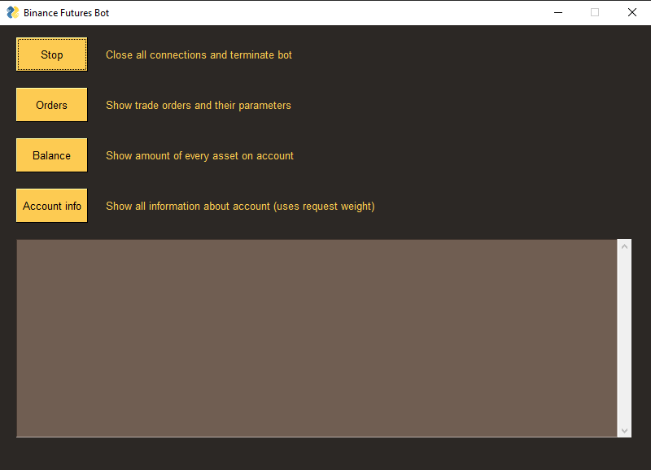

## Binance futures trade bot
Published version of the bot has no strategy module resposible for opening trades and stoploss. 
So in order to use it you should create your own strategy. If you want to use my version or want me to code your 
strategy, need help with your own bot, just contact me via e-mail _[chilik342@gmail.com](mailto:chilik342@gmail.com)_

### Install dependencies
* pip install wheel
* pip install -r requirements.txt
* pip install path_to_Twisted.whl

### Prepare your account
Bot requires connection to binance with __API key__ and __API secret key__ which you can get from 
_[website](https://www.binance.com/)_ in the upper right corner - person icon - API management - create new API key. 
After receiving the keys, rename __rename_as_credentials__ file and insert keys.

### Finishing touch
You can change trade symbol, leverage, stoploss percent or enable testmode in BinanceFuturesBot.py
> I'm still working on bot and going to add the above features to the interface

### Interface

